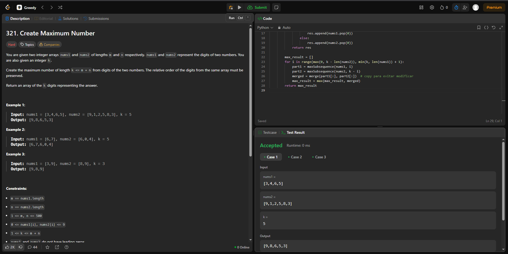

# Greed-Exercise

**Número da Lista**: 46<br>
**Conteúdo da Disciplina**: Greed<br>

## Alunos
|Matrícula | Aluno |
| -- | -- |
| 222006712 | Fábio Gabriel da Silva Barbosa |
| 221022696 | Nathan Benigno Ponce de Abreu |


## Sobre 


### Questões Médias
| Título | Responsável | 
| -- | -- | 
| 416. Partition Equal Subset Sum | Fábio gabriel | 
|  435. Least is Most | Nathan Abreu | 


### Questões Difíceis
| Título | Responsável | 
| -- | -- | 
| 1235. Maximum Profit in Job Scheduling | Fábio Gabriel | 
|  321. Create Maximum Number | Nathan Abreu | 


## Screenshots
### [416. Partition Equal Subset Sum (Knapsack)](https://leetcode.com/problems/partition-equal-subset-sum/description/)


### [1235. Maximum Profit in Job Scheduling (Interval Sheduling)](https://leetcode.com/problems/maximum-profit-in-job-scheduling/description/)


### [435. Non-overlapping Intervals (Interval Scheduling)](https://leetcode.com/problems/non-overlapping-intervals/description/)


### [321. Create Maximum Number (Caminhoneiro)](https://leetcode.com/problems/create-maximum-number/description/?envType=problem-list-v2&envId=greedy)




## Link do vídeo

https://youtu.be/K6znaqnM7F0

## Guia de execução
### 416. Partition Equal Subset Sum (Knapsack)
Abra o terminal e vá para pasta Fabio
```
cd ~/Greed-Exercise/Fabio
```
para compilar e executar
```
gcc -o partition partition.c
./partition
```
Exemplo de uso:
```
Digite a quantidade de números: 4
Digite os 4 números:
1 5 11 5

```
Saida esperada:
```
True

```
### 1235. Maximum Profit in Job Scheduling (Interval Sheduling)
Abra o terminal e vá para pasta Fabio
```
cd ~/Greed-Exercise/Fabio
```
para executar
```
python Interval.py
```
Saida esperada:
```
Max Profit: 120

```
## Instalação 
GCC instalado 
python instalado

**Linguagem**: C, Python <br>
